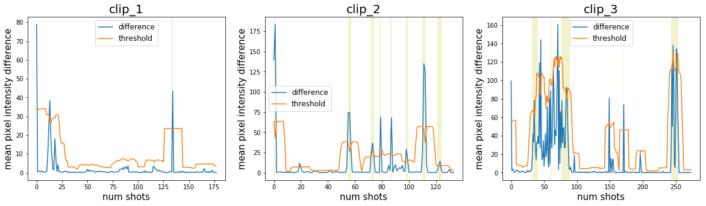
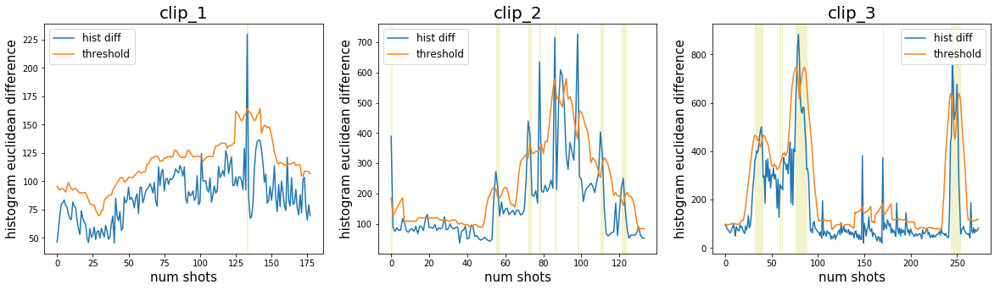
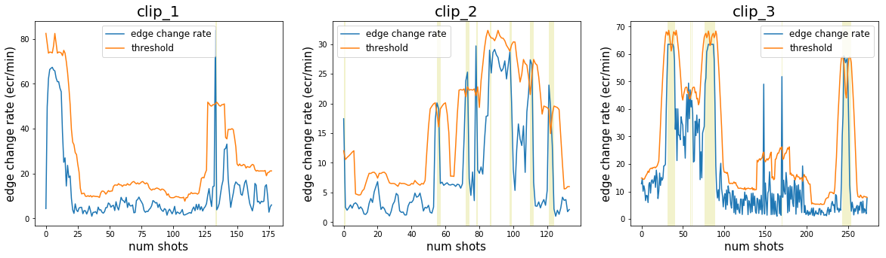
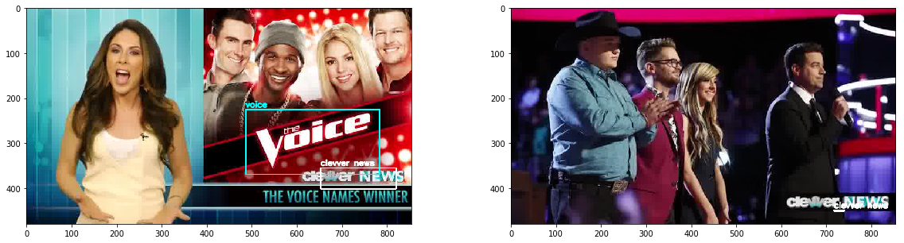
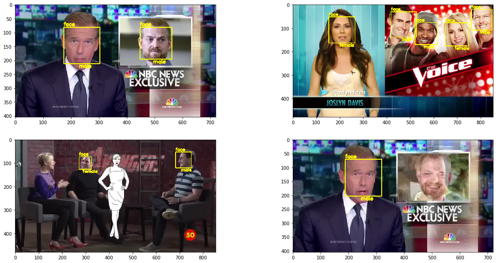

# Broadcast Video Feature Detection
> The training data are for course usage only, so it's not permitted to publish online. `demo.ipynb` is not able to be re-rendered by cloning the repo. The detailed result of this project is in the [**report**](https://jerryishihara.github.io/csc420/pdf/CSC420_project.pdf).

## Features

* [x] Video shot detection.
* [x] Commercial logo detection.
* [x] Face & gender detection.
* [x] Tracking faces between consecutive frames.

## Results
### Shot Detection

- mean intensity measurement

- color histogram comparison

- edge change ratio

### Logo Detection

### Face & Gender Detection

